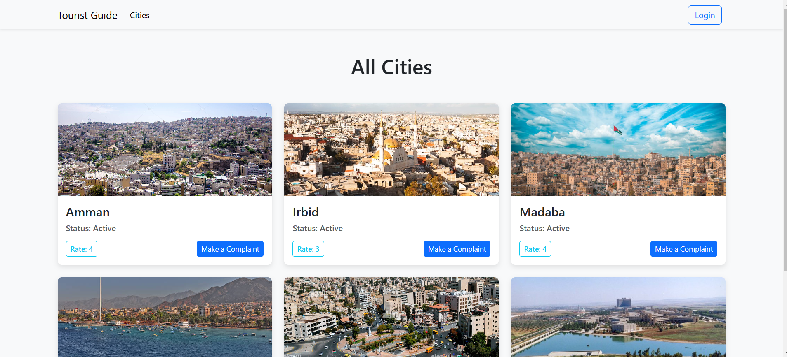

# webApplaction
A Tourist Guide for Traffic and Litter Violations
Following the MVC architectural pattern,  use Java JSPs to develop a tourist guide for traffic
and litter violations in a city.

  

